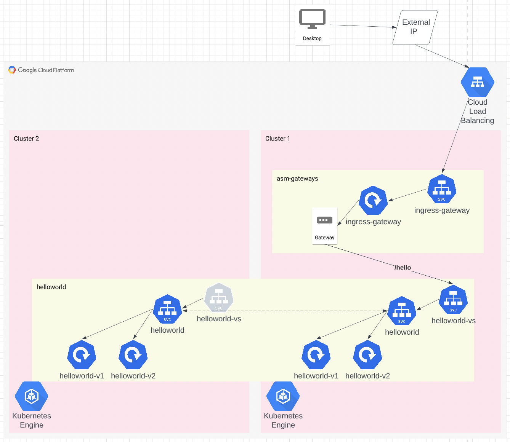

# Multi-cluster Anthos Service Mesh using managed control plane

## Diagram

## Deploy Steps
1. Deploy the Terraform

        cd ~/src/anthos-examples/asm/infra

    update the values in `var_inputs.auto.tfvars` file

        terraform init && terraform apply

2. Enable multi-cluster mesh, from the cloud console, run:

        curl https://storage.googleapis.com/csm-artifacts/asm/asmcli_1.13 > asmcli
        chmod +x asmcli
        ./asmcli create-mesh <project_id> \
            <project_id>/us-west1/<project_id>-cluster1 \
            <project_id>/us-east1/<project_id>-cluster2

6. Get the cluster contexts

        export PROJECT_ID=<gcp_project_id>
        gcloud container clusters get-credentials ${PROJECT_ID}-cluster1 --region us-west1 --project ${PROJECT_ID}
        gcloud container clusters get-credentials ${PROJECT_ID}-cluster2 --region us-east1 --project ${PROJECT_ID}

7. On Cluster1, deploy ASM configuration and app manifests via kustomize

        cd anthos-examples/asm
        kubectl apply -k manifests/ --context=gke_${PROJECT_ID}_us-west1_${PROJECT_ID}-cluster1

6. On Cluster2, deploy only the app manifests via kustomize

        kubectl apply -k manifests/app/ --context=gke_${PROJECT_ID}_us-east1_${PROJECT_ID}-cluster2

# Review your work

On Cluster1, you should have an `ingress-gateway` -> `gateway` -> `virtual service` -> `service` -> `helloworld app v1 & v2`  

The `ingress-gateway` Service is created as a LoadBalancer, so there will be an external IP attached:

    $> kubectl get svc -n asm-gateways --context=gke_${PROJECT_ID}_us-west1_${PROJECT_ID}-cluster1 
    NAME                   TYPE           CLUSTER-IP     EXTERNAL-IP    PORT(S)                                      AGE
    istio-ingressgateway   LoadBalancer   10.10.10.222   34.145.40.31   15021:30590/TCP,80:31782/TCP,443:31892/TCP   47h

Opening that IP in a browser (e.g. http://34.145.40.31/hello from the example output above) will show you the output of the helloworld app.
Refreshing the page will give you a different pod id & version. With 4 pods running (2 per cluster, 2 per version) you will
get a total of 4 different pod ids as you continue to refresh the page. This is because Istio is round-robin load-balancing
the pods running behind the service.

On Cluster2, you should have `gateway` -> `virtual service` -> `service` -> `helloworld app v1 & v2`
